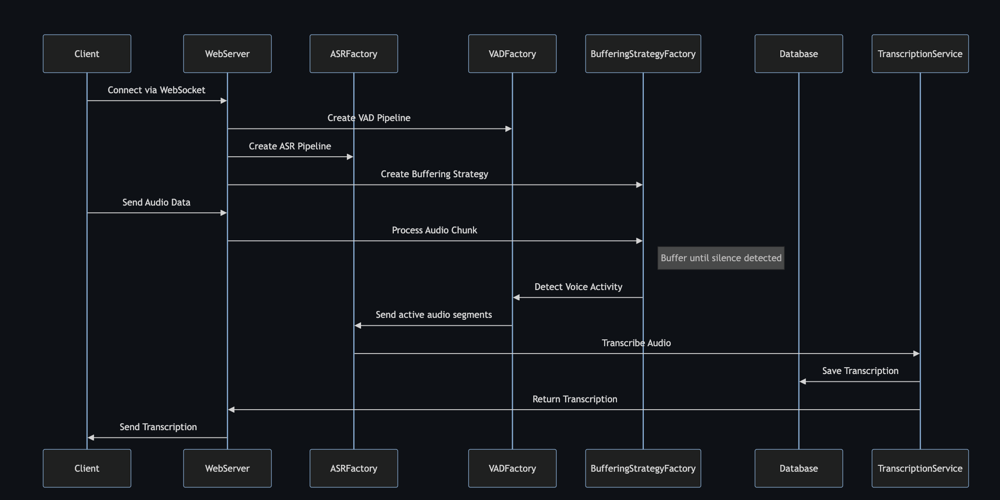
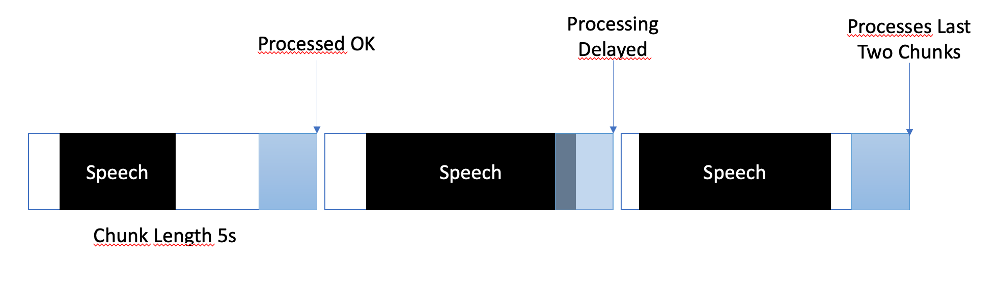

# Real-Time Transcription Service

## Problem Statement
All judges have typist assistants who help them type out orders, judgments, and frame witness depositions. The judge dictates the orders, judgments, and depositions to the typist, who then manually types the contents, proofreads them, makes corrections, and then sends it back to the judge for signing. The objective of the PoC is to enable speech-to-text transcription so that the manual effort of typing the orders and judgments can be saved.

[Detailed Problem Statement Document](https://docs.google.com/document/d/18cPXS3v0DVsTyRsxc-GNYWkmMqV3qqYeKEa8Adki1lM)

## Overview
The Real-Time Transcription Service allows users to create and join rooms where they can send audio data to be transcribed in real-time. Users can spectate the transcription, update it, and save the final transcript. When the transcription is saved, the service merges audio segments into a single file and uploads both the transcript and audio file to MinIO, providing download links to all participants.

## Features
- **Real-time transcription**: Transcribe audio data as it is received.
- **Room management**: Create, join, and leave rooms.
- **Collaboration**: Multiple users can view and update the transcription in real-time.
- **Persistent storage**: Save transcripts and merged audio files, upload them to MinIO, and distribute download links.
- Modular design for easy integration of different VAD and ASR technologies.
- Factory and strategy pattern implementation for flexible component management.
- Unit testing framework for robust development.
- Customizable audio chunk processing strategies.
- Support for multilingual transcription.
- Supports Secure Sockets with optional cert and key file arguments

## Usage
- **Create a room**:
Clients connect to the server via WebSocket and create a room by sending a create_room request.

- **Join a room**:
Other users can join the room using the join_room request, providing the room ID.

- **Send audio data**:
Clients send audio data to the server in base64 format.

- **View and update transcription**:
Users can see the real-time transcription and make updates. Changes are broadcasted to all participants.

- **Save transcription**:
When ready, users can save the transcription. This action:

   - Merges the audio segments into a single file.
   - Saves the transcript to a text file. 
   - Uploads both files to MinIO. 
   - Distributes download links to all users.

## Flow Diagram



- **Client connects via WebSocket**: The client establishes a WebSocket connection with the WebServer.
- **Send Audio Data**: The client sends audio data through the WebSocket connection.
- **Create ASR Pipeline**: The WebServer initializes the Automatic Speech Recognition (ASR) pipeline through the ASRFactory.
- **Create VAD Pipeline**: Simultaneously, the WebServer creates a Voice Activity Detection (VAD) pipeline using the VADFactory.
- **Create Buffering Strategy**: The ASR and VAD pipelines collaborate to establish a buffering strategy through the BufferingStrategyFactory.
- **Process Audio Chunk**: The WebServer processes incoming audio chunks according to the established buffering strategy.
- **Detect Voice Activity**: The VAD pipeline analyzes the audio chunks to detect voice activity.
- **Send active audio segments**: Once voice activity is detected, the system identifies active audio segments and sends them for transcription.
- **Transcribe Audio**: The ASR pipeline transcribes the active audio segments into text.
- **Return Transcription**: The transcribed text is returned to the WebServer.
- **Save Transcription**: The transcription is saved in the database.
- **Send Transcription**: The WebServer sends the transcription back to the client.
- **Buffer until silence detected**: The system continues to buffer audio until silence is detected, at which point it processes the buffered data for transcription.

## Running with Docker

This will not guide you in detail on how to use CUDA in docker, see for example [here](https://medium.com/@kevinsjy997/configure-docker-to-use-local-gpu-for-training-ml-models-70980168ec9b).

Still, these are the commands for Linux:

```bash
distribution=$(. /etc/os-release;echo $ID$VERSION_ID) \
&& curl -fsSL https://nvidia.github.io/libnvidia-container/gpgkey | sudo gpg --dearmor -o /usr/share/keyrings/nvidia-container-toolkit-keyring.gpg \
&& curl -s -L https://nvidia.github.io/libnvidia-container/$distribution/libnvidia-container.list | \
sed 's#deb https://#deb [signed-by=/usr/share/keyrings/nvidia-container-toolkit-keyring.gpg] https://#g' | \
sudo tee /etc/apt/sources.list.d/nvidia-container-toolkit.list

sudo nvidia-ctk runtime configure --runtime=docker

sudo systemctl restart docker
```

You can build the image with:

```bash
sudo docker build -t transcription-service .
```

After getting your VAD token (see next sections) run:

```bash

sudo docker volume create huggingface_models

sudo docker run --gpus all -p 8765:8765 -v huggingface_models:/root/.cache/huggingface  -e PYANNOTE_AUTH_TOKEN='VAD_TOKEN_HERE' transcription-service
```

The "volume" stuff will allow you not to re-download the huggingface models each time you re-run the container. If you don't need this, just use:

```bash
sudo docker run --gpus all -p 8765:8765 -e PYANNOTE_AUTH_TOKEN='VAD_TOKEN_HERE' transcription-service
```

## Manual Installation

To set up the Transcription Service server, you need Python 3.8 or later and the following packages:

1. `transformers`
2. `pyannote.core`
3. `pyannote.audio`
4. `websockets`
5. `asyncio`
6. `sentence-transformers`
7. `faster-whisper`

Install these packages using pip:

```bash
pip install -r requirements
```

For the client-side, you need a modern web browser with JavaScript support.

## Configuration and Usage

### Server Configuration

The Transcription Service server can be customized through command line arguments, allowing you to specify components, host, and port settings according to your needs.

- `--vad-type`: Specifies the type of Voice Activity Detection (VAD) pipeline to use (default: `pyannote`) .
- `--vad-args`: A JSON string containing additional arguments for the VAD pipeline. (required for `pyannote`: `'{"auth_token": "VAD_AUTH_HERE"}'`)
- `--asr-type`: Specifies the type of Automatic Speech Recognition (ASR) pipeline to use (default: `faster_whisper`).
- `--asr-args`: A JSON string containing additional arguments for the ASR pipeline (one can for example change `model_name` for whisper)
- `--host`: Sets the host address for the WebSocket server (default: `127.0.0.1`).
- `--port`: Sets the port on which the server listens (default: `8765`).
- `--certfile`: The path to the SSL certificate (cert file) if using secure websockets (default: `None`)
- `--keyfile`: The path to the SSL key file if using secure websockets (default: `None`)

For running the server with the standard configuration:

1. Obtain the key to the Voice-Activity-Detection model at [https://huggingface.co/pyannote/segmentation](https://huggingface.co/pyannote/segmentation)
2. Run the server using Python 3.x, please add the VAD key in the command line:

```bash
python3 -m src.main --vad-args '{"auth_token": "vad token here"}'
```

You can see all the command line options with the command:

```bash
python3 -m src.main --help
```

## Client Usage

1. Open the `client/VoiceStreamAI_Client.html` file in a web browser.
2. Enter the WebSocket address (default is `ws://localhost:8765`).
3. Configure the audio chunk length and offset. See below.
4. Select the language for transcription.
5. Click 'Connect' to establish a WebSocket connection.
6. Use 'Start Streaming' and 'Stop Streaming' to control audio capture.

## Technology Overview

- **Python Server**: Manages WebSocket connections, processes audio streams, and handles voice activity detection and transcription.
- **WebSockets**: Used for real-time communication between the server and client.
- **Voice Activity Detection**: Detects voice activity in the audio stream to optimize processing.
- **Speech-to-Text**: Utilizes [Faster Whisper](https://github.com/SYSTRAN/faster-whisper) or OpenAI's Whisper model (openai/whisper-large-v3) for accurate transcription. Faster Whisper is the default as it is much faster

## Technical Overview

### Room

#### Overview
A room is a real-time transcription session where multiple users can join, get real-time transcription, update the transcription, or download audio and transcription files. The idea is that a judge and typist will be part of a transcription session, and both will be able to spectate or update the transcription in real-time.

#### Need
Since both the judge and typist should be able to record and update the transcription for a transcription session, we can't start a new session for each user. Rather, we need a functionality where a user can create a new session or join an older session to view or update older transcription. For this, an in-memory dictionary keeps track of the session and the users who are part of the room. Every time there is an update, the message is broadcasted to all the users to share real-time updates.

#### Working
Whenever a user clicks on create room, a new room object with default config is created, and a new entry is created in an in-memory dictionary. It stores all the clients that are connected to this room, which helps in broadcasting any message. Whenever a user leaves a room, the user is removed from this list of users. For any user to connect to a room, that room should be present in the dictionary. This room ID is also used to store transcription and audio files in the database and later helps to generate download links for these artifacts.

### Model Used
By default, if you don't provide any argument for ASR, it uses the Whisper large-v3 model. We recommend using this model because of the following reasons:
- The translation accuracy of the Whisper large-v3 model for different languages is much higher.
- It has a lower Word Error Rate (WER) for various languages.
- It has improved continuous numbers transcription compared to other models. 

#### Switch to different model

If you want to switch to a different model, you need to run `src.main` with the following arguments:

```bash
python3 -m src.main --asr-args '{"model_size": "large"}'
```

### Settings

### Factory and Strategy patterns

Both the VAD and the ASR components can be easily extended to integrate new techniques and use models with an different interface than HuggingFace pipelines. New processing/chunking strategies can be added in server.py, and used by the specific clients setting the "processing_strategy" key in the config.

### Voice Activity Detection (VAD)

Voice Activity Detection (VAD) in Transcription Service enables the system to distinguish between speech and non-speech segments within an audio stream. The primary purpose of implementing VAD is to enhance the efficiency and accuracy of the speech-to-text process:

- **Reduces Computational Load**: By identifying and processing only those segments that contain speech, VAD significantly reduces the computational resources required for transcription. This is important considering that the speech recognition pipeline takes 7 seconds on a Tesla T4 (16Gb) - take this into consideration when setting the chunk length.
- **Improves Transcription Accuracy**: Processing only the voice segments minimizes the chances of non-speech noises being misinterpreted as speech, thus improving the overall accuracy of the transcription.
- **Optimizes Network Utilization**: In a streaming context, sending only voice segments over the network, as opposed to the entire audio stream, optimizes bandwidth usage.

Transcription Service uses a Huggingface VAD model to ensure reliable detection of speech in diverse audio conditions.

### Processing Strategy "SilenceAtEndOfChunk"

The buffering strategy is designed to balance between near-real-time processing and ensuring complete and accurate capture of speech segments. Here’s how buffering is managed:

- **Chunk-Based Processing**: The audio stream is processed into chunks of a per-client customizable length (defaults to 5 seconds)
- **Silence Handling**: A minimum silence offset is defined to allow for continuous listening and capturing audio beyond the end of a single chunk. This ensures that words at the boundary of chunks are not cut off, thereby maintaining the context and completeness of speech. This introduces extra latency for very dense parts of speech, as the transciprion will not take place until a pause is identified.
- **Dynamic Buffer Management**: The system dynamically manages buffers for each client. When new audio data arrives, it is appended to the client's temporary buffer. Once a buffer reaches the chunk length, it is processed, and the buffer is cleared, ready for new data.



### Client-Specific Configuration Messaging

In Transcription Service, each client can have a unique configuration that tailors the transcription process to their specific needs. This personalized setup is achieved through a messaging system where the JavaScript client sends configuration details to the Python server. This section explains how these configurations are structured and transmitted.

The client configuration can include various parameters such as language preference, chunk length, and chunk offset. For instance:

- `language`: Specifies the language for transcription. If set to anything other than "multilanguage" it will force the Whisper inference to be in that language
- `processing_strategy`: Specifies the type of processing for this client, a sort of strategy pattern. Strategy for now aren't using OOP but they are implemented in an if/else in server.py
- `chunk_length_seconds`: Defines the length of each audio chunk to be processed
- `chunk_offset_seconds`: Determines the silence time at the end of each chunk needed to process audio (used by processing_strategy nr 1).

### Transmitting Configuration

1. **Initialization**: When a client initializes a connection with the server, it can optionally send a configuration message. This message is a JSON object containing key-value pairs representing the client's preferred settings.

2. **JavaScript Client Setup**: On the demo client, the configuration is gathered from the user interface elements (like dropdowns and input fields). Once the Audio starts flowing, a JSON object is created and sent to the server via WebSocket. For example:

```javascript
function sendAudioConfig() {
  const audioConfig = {
    type: "config",
    data: {
      chunk_length_seconds: 5,
      chunk_offset_seconds: 1,
      processing_strategy: 1,
      language: language,
    },
  };
  websocket.send(JSON.stringify(audioConfig));
}
```
## Testing

The testing suite includes:

1. **Audio Transcription Accuracy**:
   - Tests are conducted on 3 audio files of actual judgments.
   - Similarity scores to the original judgment documents:
     - Audio 1: 98% similarity
     - Audio 2: 89% similarity
     - Audio 3: 94% similarity 

2. **System Functionality**:
   - WebSocket connection establishment
   - Room creation
   - Multi-client room joining

3. **Model Selection**:
   - Ability to choose and test different transcription models
   - When implementing a new ASR, VAD, or Buffering Strategy, you can test it with:
     ```bash
     ASR_TYPE=<asr_type> python3 -m unittest test.server.test_server
     ```
   - The current supported ASR types are:
     ```bash
     ASR_TYPE=faster_whisper python3 -m unittest test.server.test_server
     ```
     ```bash
     ASR_TYPE=bhashini python3 -m unittest test.server.test_server
     ```

- Please make sure that the end variables are in place for example for the VAD auth token. Several other tests are in place, for example for the standalone ASR.

- Audio file requirements for testing:
     - Sample rate: 16 kHz
     - Bitrate: 256 kbps
     - Channel: Mono

## Areas for Improvement

### Challenges with Small Audio Chunks in Whisper

- **Context Loss**: Shorter audio segments may lack sufficient context, leading Whisper to misinterpret the speech or fail to capture the nuances of the dialogue.
- **Accuracy Variability**: The accuracy of transcription can vary with the length of the audio chunk. Smaller chunks might result in less reliable transcriptions compared to longer segments.

### Dependence on Audio Files

Currently, Transcription Service processes audio by saving chunks to files and then running these files through the models.

### Introduce other ASR models

Transcription Service currently support faster whisper and whisper asr. In future we should add support for following asr models.
1. [**Bhashini (Highest Priority)**](https://github.com/pucardotorg/dristi_experiments/issues/19)
2. WhisperX
3. OpenAI Whisper API

## Contributors

- Suyash Gautam - [suyash.gautam97@gmail.com](mailto:suyash.gautam97@gmail.com)
- Sarvesh Atawane - [sarveshatawane03@gmail.com](mailto:sarveshatawane03@gmail.com)

This project is open for contributions. Feel free to fork the repository and submit pull requests.